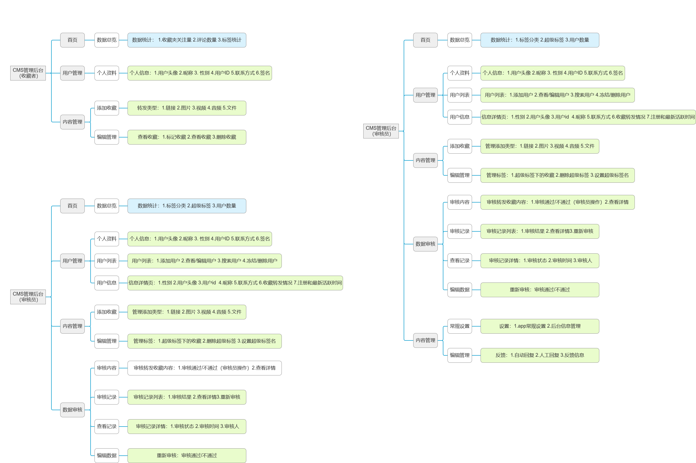
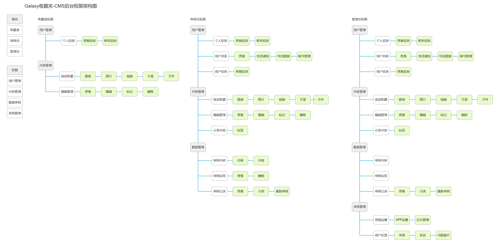

# 💹 Galaxy 市场需求文档
## 一、产品定位
## 二、目标市场
## 三、用户分析
### 目标用户
* **人群定位**：青年及中青年群体
* **年龄层**：15-45岁  
根据产品定位是一款兼具“收藏与社交”的APP，我们将用户定位在15-45岁的群体中，这类人群具有明显的兴趣差异，在日常生活中对于收藏分类喜欢的内容和与他人社交有很大需求，对平台发展会有较大的推动作用。
* **具体人群**
1. 经常在网络上浏览图片、视频、文章或网页的人群
2. 有对喜欢的内容进行收藏或保存习惯的人群
2. 喜欢与他人在网络上进行交流、分享的人群
3. 需要有条理得归纳、整理文件的人群
4. 爱好小众，希望找到有相同爱好的用户的人群

## 四、竞品分析
---
# 👩🏻‍💻 CMS产品信息设计
### 产品架构图

### 权限架构图
